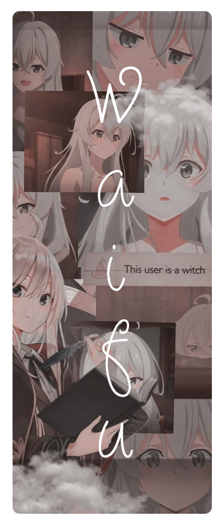

 

 
 
  
- Name **Reidho Satria**

- Live in **Palembang, Indonesia**

- Studying [***Computer And Network Engineering***](https://smkn4palembang.sch.id/)

- Good with **Javascript** , **Typescript** , **PHP** , **Bash** , **CSS** , **HTML** and **Python**

- Have high experience with **Photoshop** and **CorelDRAW**
  
- Familiar with **Debian**, **Ubuntu**, **Fedora**, **Arch**, **Void** and **OpenSUSE**

- Understand 日本語 (N5), Bahasa (Native), and English (Fluent)

 

 
 
  
- 📗 [***Elliottophellia/ayano***](https://github.com/Elliottophellia/ayano)  
  A multipurpose bot for anything with 69 commands!
- 📘 [***Elliottophellia/kyoko***](https://github.com/Elliottophellia/kyoko)  
  Random anime pictures and quotes API, Toshino Kyoko.
- 📙 [***Elliottophellia/ophellia***](https://github.com/Elliottophellia/ophellia)  
  A simple webshell build in PHP 7.4 for penetration testing and educational purposes only.
- 📒 [***Elliottophellia/mocha***](https://github.com/Elliottophellia/mocha)  
  A discord selfbot designed to bumping disboard.org every 2 hours.

 
 
  
 *“People with evil intent can do evil things without lying. And not all liars are evil.” – Elaina* 
<!--

-->

